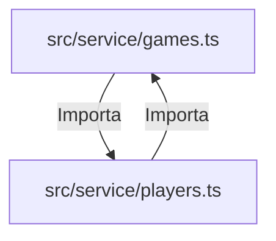
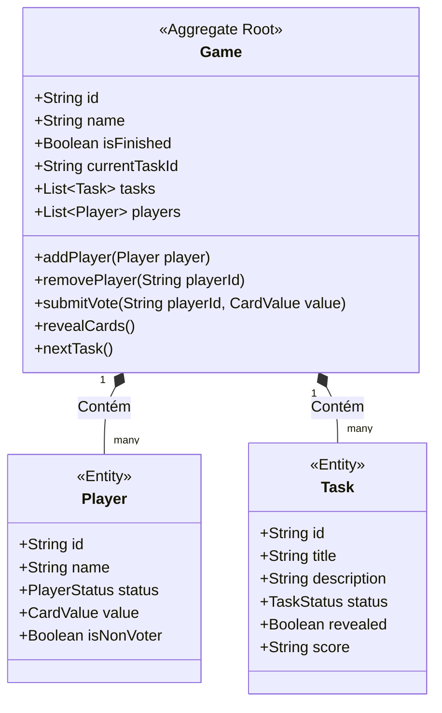
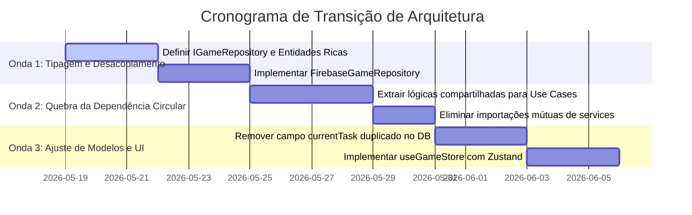

# Plano de Modernização Arquitetural: Planning Poker

Este documento apresenta uma análise detalhada da arquitetura atual da aplicação **Planning Poker**, diagnostica os principais problemas estruturais e de design de código, e propõe uma nova arquitetura de referência baseada em **Clean Architecture** e **Domain-Driven Design (DDD)**. 

---

## 1. Diagnóstico da Arquitetura Atual (Principais Dores)

### 1.1 Dependência Circular (Circular Dependency)
Existe uma dependência circular explícita entre os serviços de **Games** e **Players**:
* `src/service/games.ts` importa de `src/service/players.ts` (`resetPlayers`, `updatePlayerGames`, `removeGameFromCache`).
* `src/service/players.ts` importa de `src/service/games.ts` (`updateGameStatus`).



> [!WARNING]
> Acoplamentos circulares geram comportamentos inesperados em empacotadores (Vite/Webpack), dificultam testes unitários isolados e violam o Princípio da Dependência Acíclica (ADP).

---

### 1.2 Inconsistência de Estado (Drift) no Banco de Dados
O estado de uma "tarefa ativa" está duplicado em dois lugares na modelagem do Firestore:
1. No array global `tasks` (dentro do documento do jogo).
2. Na propriedade raiz `currentTask` (atualizada dinamicamente em tempo real).

Isso gerou bugs de sincronia onde a revelação de cards atualizava apenas um dos lados, forçando a criação de lógicas de "merge" complexas no frontend (`TasksContext`) para compensar a inconsistência da persistência.

---

### 1.3 Acoplamento Direto com a Infraestrutura (Firebase)
Os serviços (`src/service/*.ts`) importam e consomem diretamente os métodos de infraestrutura do arquivo `src/repository/firebase.ts` e do Firestore SDK.

> [!IMPORTANT]
> A lógica de negócio (ex: como um voto é computado ou quando um jogo muda de status) está acoplada à tecnologia de persistência. Se decidirmos migrar para Supabase, PostgreSQL ou WebSockets puros, teremos que reescrever toda a camada de serviços.

---

### 1.4 Vazamento de Regras de Negócio para a UI
Diversas lógicas e tomadas de decisão importantes ocorrem diretamente dentro do ciclo de renderização do React:
* Descobrir se os cards podem ser revelados ou não (`PlayerCard.tsx` / `GameBoard.tsx`).
* Cálculo estatístico de média, moda e valor mais próximo (`computeStoryVoteStatistics`).
* Lógica de ordenação de tarefas ao salvar.

Componentes visuais devem ser burros (focados apenas em renderizar a tela baseando-se em propriedades explícitas). Lógicas de negócio pertencem a modelos de domínio puro.

---

## 2. Nova Definição de Limites de Entidades (DDD)

Para reestruturar as responsabilidades do sistema, utilizaremos conceitos de **Domain-Driven Design (DDD)**:



### 2.1 Game como Aggregate Root (Raiz de Agregação)
* **Game** é o coração da aplicação. Nenhuma alteração em `Player` (como votar) ou `Task` (como revelar cards) deve acontecer de forma isolada do fluxo do jogo.
* O `Game` é responsável por validar as transições de estado (ex: "só posso revelar cards se a tarefa atual estiver sendo votada" ou gerenciar se o jogo foi finalizado através da flag `isFinished`).

### 2.2 Players e Tasks como Entidades Internas
* **Player** e **Task** não possuem repositórios próprios na lógica de domínio. Toda alteração neles deve passar pelo agregado `Game` para garantir consistência estrutural.

---

## 3. Proposta de Nova Estrutura de Pastas

Adotaremos a estrutura modular de **Clean Architecture**, separando regras de negócio puras (Domain/Use Cases) de detalhes de tecnologia (Infrastructure/UI).

```text
src/
├── core/                   # Regras de Negócio Puras (Independente de Frameworks)
│   ├── domain/             # Entidades de Domínio, Exceções e Interfaces
│   │   ├── entities/       # Game.ts, Player.ts, Task.ts
│   │   ├── value-objects/  # CardConfig.ts, TimerProps.ts
│   │   └── repositories/   # IGameRepository.ts (Apenas a assinatura dos métodos)
│   └── use-cases/          # Casos de Uso (Orquestradores de regras de negócio)
│       ├── CreateGame.ts
│       ├── VoteOnTask.ts
│       ├── RevealCards.ts
│       └── SkipTask.ts
├── infrastructure/         # Detalhes de Implementação Tecnológica
│   ├── firebase/           # Implementação real do IGameRepository consumindo Firestore
│   │   ├── FirebaseGameRepository.ts
│   │   └── firebase.config.ts
│   └── cache/              # LocalStorage e gerenciamento de sessões locais
├── presentation/           # Camada Visual (React)
│   ├── components/         # Componentes puros de UI (ex: PlayerCard, Button, Dialog)
│   ├── stores/             # Zustand Stores (ex: useGameStore.ts) para sincronização real-time
│   ├── pages/              # Telas da aplicação (PokerPage, HomePage)
│   └── hooks/              # Hooks customizados para facilitar consumo
```

---

## 4. Refatoração de Lógica de Negócio: Ports & Adapters (Repositórios)

Para desacoplar a aplicação do Firebase, criamos uma interface (Port) no domínio:

### 4.1 Interface de Repositório (`src/core/domain/repositories/IGameRepository.ts`)
```typescript
import { Game } from '../entities/Game';
import { Player } from '../entities/Player';

export interface IGameRepository {
  getById(gameId: string): Promise<Game | null>;
  save(game: Game): Promise<void>;
  delete(gameId: string): Promise<void>;
  streamGame(gameId: string, callback: (game: Game) => void): () => void;
  streamPlayers(gameId: string, callback: (players: Player[]) => void): () => void;
}
```

### 4.2 Detalhamento de Casos de Uso (Sem Dependência de GameStatus)

Toda a lógica de negócios da aplicação será movida para Casos de Uso focados e desacoplados do `Status` global do jogo. O estado geral da sessão agora será controlado estritamente pelo booleano `isFinished`. 

Abaixo, descrevemos as responsabilidades e assinaturas dos principais casos de uso do sistema:

#### A. `VoteOnTask` (Registrar Votação do Usuário)
* **Objetivo:** Registrar o valor do card e emoji de votação de um participante específico na rodada ativa.
* **Assinatura:** `VoteOnTask.execute(gameId: string, playerId: string, cardValue: number, emoji: string): Promise<void>`
* **Validações e Regras:**
  * O jogo não pode estar finalizado (`isFinished` deve ser `false`).
  * Busca o jogador associado e atualiza o seu valor de voto local e o seu status de jogador para `Finished`.
  * Se o recurso de *AutoReveal* estiver ativo no jogo, verifica se todos os participantes válidos já votaram para disparar automaticamente a revelação de cards.

```typescript
export class VoteOnTask {
  constructor(private gameRepository: IGameRepository) {}

  async execute(gameId: string, playerId: string, cardValue: number, emoji: string): Promise<void> {
    const game = await this.gameRepository.getById(gameId);
    if (!game) throw new Error('Game not found');
    if (game.isFinished) throw new Error('Cannot vote on a finished game');

    game.submitVote(playerId, cardValue, emoji);
    await this.gameRepository.save(game);
  }
}
```

#### B. `RevealCards` (Revelar Cards de Votação)
* **Objetivo:** Forçar a revelação de todos os votos dos jogadores da rodada ativa para aquela tarefa.
* **Assinatura:** `RevealCards.execute(gameId: string): Promise<void>`
* **Validações e Regras:**
  * Localiza a tarefa ativa no array de `tasks`.
  * Altera o status da tarefa ativa para `'voted'` e seta a propriedade `revealed` da tarefa para `true`.
  * Não afeta o status global do jogo, apenas a tarefa em questão.

```typescript
export class RevealCards {
  constructor(private gameRepository: IGameRepository) {}

  async execute(gameId: string): Promise<void> {
    const game = await this.gameRepository.getById(gameId);
    if (!game) throw new Error('Game not found');

    game.revealCurrentTask();
    await this.gameRepository.save(game);
  }
}
```

#### C. `NextTask` (Ir para a Próxima Tarefa)
* **Objetivo:** Salvar a pontuação da tarefa atual, mudar o ponteiro `currentTaskId` para a próxima pendente e resetar os votos dos jogadores para a nova rodada.
* **Assinatura:** `NextTask.execute(gameId: string, score?: string, skipped?: boolean): Promise<void>`
* **Validações e Regras:**
  * Seta a tarefa ativa atual com a pontuação (`score`) e atualiza o status dela para `'voted'` (ou `'skipped'` se pulada).
  * Busca a próxima tarefa da lista cujo status seja `'pending'` ou `'skipped'`.
  * Se encontrar uma próxima tarefa:
    * Altera a propriedade `currentTaskId` para a nova tarefa.
    * Seta o status da nova tarefa ativa para `'voting'`.
    * Reseta os votos e status de todos os jogadores para `NotStarted`.
  * Se **não** houver mais nenhuma tarefa pendente:
    * Marca o jogo como finalizado (`isFinished = true`).
    * Reseta os votos e status de todos os jogadores para `NotStarted`.

```typescript
export class NextTask {
  constructor(private gameRepository: IGameRepository) {}

  async execute(gameId: string, score?: string, skipped?: boolean): Promise<void> {
    const game = await this.gameRepository.getById(gameId);
    if (!game) throw new Error('Game not found');

    game.goToNextTask(score, skipped);
    await this.gameRepository.save(game);
  }
}
```

#### D. `FinishGame` (Finalizar a Sessão de Planning)
* **Objetivo:** Terminar a sessão inteira do jogo voluntariamente, travando novas votações e consolidando a tela de resultados.
* **Assinatura:** `FinishGame.execute(gameId: string): Promise<void>`
* **Validações e Regras:**
  * Altera a flag `isFinished` da entidade `Game` para `true`.
  * Não recalcula nenhum status dinâmico de jogador ou progresso.

```typescript
export class FinishGame {
  constructor(private gameRepository: IGameRepository) {}

  async execute(gameId: string): Promise<void> {
    const game = await this.gameRepository.getById(gameId);
    if (!game) throw new Error('Game not found');

    game.finish();
    await this.gameRepository.save(game);
  }
}
```

---

## 5. Melhorias nas Estruturas de Dados

### 5.1 Eliminação do Campo Inconsistente `currentTask`
* **Solução:** Remover a propriedade duplicada `currentTask` da raiz do documento no Firestore.
* **Nova Regra:** O frontend e o backend devem ler a tarefa ativa exclusivamente filtrando a lista `tasks` pelo `currentTaskId`.
* **Como manter reativo:** O Firebase já envia o snapshot do jogo inteiro a cada mudança no array `tasks`. Utilizando a lógica correta de mapeamento, o React renderizará de forma instantânea.

### 5.2 Substituição de `gameStatus` por `isFinished: boolean` e Remoção da Feature de Status
* **Problema:** A aplicação mantinha um campo complexo de status do jogo (`gameStatus`), exigindo que o backend recalculasse dinamicamente se o jogo estava "Iniciado", "Em andamento" ou "Finalizado" com base em quem estava votando. Isso gerava dependência circular e vazava responsabilidades de visualização para o banco.
* **Solução:** 
  * Excluir o enum `Status` de jogo do domínio.
  * Adicionar o campo booleano simples `isFinished: boolean` (inicialmente `false`) à entidade `Game`.
  * Remover por completo da interface de jogo (UI) qualquer widget, badge ou cabeçalho que exibia textualmente o status do jogo (ex: "Em Andamento" ou "Finalizado"), simplificando a UI e focando apenas nos dados das tarefas.
  * A UI agora apenas decide se exibe as áreas de votação ou a visualização final do painel de controle baseada na flag `isFinished`.

### 5.3 Tipagem Estrita e Segura
* Substituir o uso de `any` em assinaturas como `updateGame(gameId, updatedGame: any)` por tipos parciais explícitos baseados em propriedades de domínio, garantindo que refatorações futuras sejam validadas em tempo de compilação.
* Desvincular qualquer enum do domínio das chaves literais de tradução i18n, deixando os mapeamentos de texto de responsabilidade exclusiva dos componentes de apresentação.

---

## 6. Gerenciamento de Estado de Alta Performance (Zustand)

Para gerenciar o fluxo de votos, jogadores ativos e tarefas em tempo real, recomendamos a substituição do React Context API pelo **Zustand**. 

### 6.1 Por que Zustand?
* **Seletores Performáticos:** Ao contrário do Context, onde qualquer alteração no `game` re-renderiza todos os consumidores, os seletores do Zustand garantem que um componente de card só atualize se o voto daquele jogador específico mudar.
* **Independência do React:** Stores do Zustand são objetos JS purificados. As inscrições e ações de tempo real podem rodar em arquivos de serviço (`.ts`) sem acoplamento à árvore DOM.
* **Sem Aninhamento de Providers:** Adeus aos Providers que envolvem as páginas, deixando os testes muito mais fáceis e o código muito mais legível.

### 6.2 Estrutura Recomendada da Store Real-time (`src/presentation/stores/useGameStore.ts`)
```typescript
import { create } from 'zustand';
import { Game } from '../../core/domain/entities/Game';
import { Player } from '../../core/domain/entities/Player';
import { Task } from '../../core/domain/entities/Task';
import { streamGame, streamPlayers } from '../../service/games';

interface GameState {
  game: Game | null;
  players: Player[];
  isLoading: boolean;
  
  // Getters derivados (Reativos e Síncronos)
  getCurrentTask: () => Task | undefined;
  
  // Ações de infraestrutura
  connectToGame: (gameId: string) => () => void;
}

export const useGameStore = create<GameState>((set, get) => ({
  game: null,
  players: [],
  isLoading: true,

  getCurrentTask: () => {
    const { game } = get();
    if (!game) return undefined;
    
    // Leitura única e centralizada do source of truth (tasks array)
    return game.tasks?.find((t) => t.id === game.currentTaskId);
  },

  connectToGame: (gameId: string) => {
    set({ isLoading: true });

    // Stream síncrono em tempo real do Jogo no Firestore
    const unsubscribeGame = streamGame(gameId).onSnapshot((snapshot) => {
      if (snapshot.exists) {
        set({ game: snapshot.data() as Game, isLoading: false });
      }
    });

    // Stream síncrono em tempo real dos Jogadores no Firestore
    const unsubscribePlayers = streamPlayers(gameId).onSnapshot((snapshot) => {
      const playersList: Player[] = [];
      snapshot.forEach((doc) => playersList.push(doc.data() as Player));
      set({ players: playersList });
    });

    // Retorna uma função de fechamento para limpar as conexões do Firebase
    return () => {
      unsubscribeGame();
      unsubscribePlayers();
      set({ game: null, players: [], isLoading: true });
    };
  },
}));
```

### 6.3 Consumo no Componente Visual (`src/components/Poker/Poker.tsx`)
```tsx
import React, { useEffect } from 'react';
import { useParams } from 'react-router-dom';
import { useGameStore } from '../../presentation/stores/useGameStore';
import { GameArea } from '../GameArea';

export const Poker = () => {
  const { id } = useParams<{ id: string }>();
  
  // Seletores específicos para evitar re-renderizações desnecessárias
  const isLoading = useGameStore((state) => state.isLoading);
  const connectToGame = useGameStore((state) => state.connectToGame);

  useEffect(() => {
    if (id) {
      const disconnect = connectToGame(id);
      return () => disconnect(); // Remove os listeners do Firebase automaticamente
    }
  }, [id, connectToGame]);

  if (isLoading) return <LoadingSpinner />;

  return <GameArea />;
};
```

---

## 7. Plano de Ação (Refactor Roadmap)

Para implementar essas melhorias sem interromper as entregas e sem quebrar a aplicação atual, sugere-se a seguinte estratégia em ondas:



### Onda 1: Tipagem e Abstração de Repositório (Sem quebra de código)
1. Criar as interfaces de domínio no diretório `src/core/domain`.
2. Implementar o `FirebaseGameRepository` implementando a interface `IGameRepository`.
3. Substituir chamadas diretas de `firebase.ts` nos serviços atuais por instâncias do novo repositório.

### Onda 2: Resolução da Dependência Circular e Criação de Use Cases
1. Criar a pasta `src/core/use-cases`.
2. Migrar a lógica contida em `resetPlayers` e `updateGameStatus` para casos de uso dedicados.
3. Fazer com que os serviços importem apenas os casos de uso ou repositórios, removendo a importação cruzada de `games.ts` e `players.ts`.

### Onda 3: Unificação de Lógica e Limpeza Visual (Zustand)
1. Executar um script simples no Firestore Emulator / Produção para limpar o campo raiz `currentTask` obsoleto.
2. Implementar a Zustand `useGameStore` para centralizar as subscrições síncronas de tempo real.
3. Conectar a camada de UI diretamente na store do Zustand, removendo permanentemente o Context API e `TasksContext`.
4. Rodar a suíte inteira de testes automatizados (`vitest`).

---

## Conclusão

A aplicação atual possui uma ótima base de tempo real com Firestore e uma interface interativa fantástica. Ao aplicar este **Plano de Modernização Arquitetural**, o projeto ganhará testabilidade impecável, escalabilidade de código para novos desenvolvedores, e uma separação de conceitos limpa que facilitará qualquer manutenção futura.

